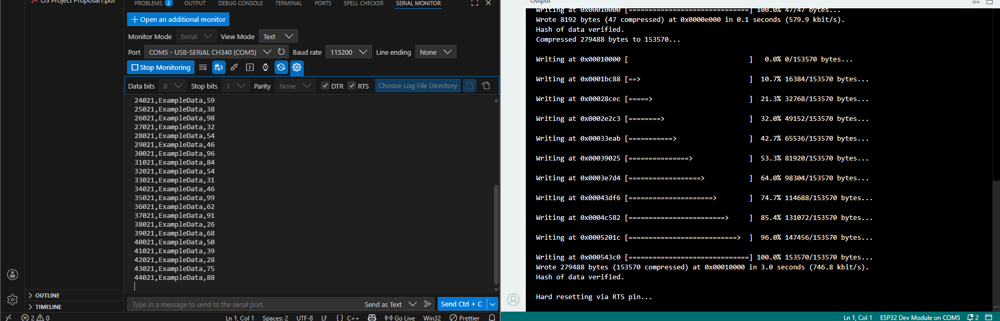
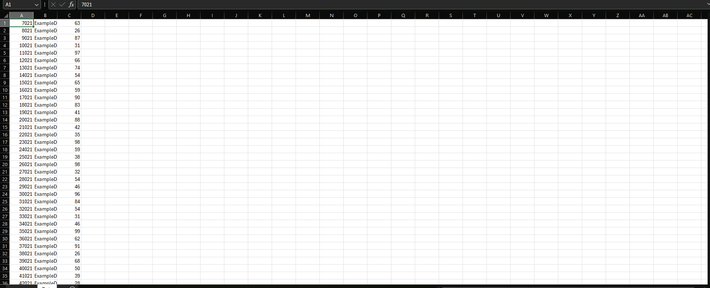

# From Serial Monitor Chaos to Structured CSV Data


A complete step-by-step guide to capturing serial monitor output as clean,
analysis-ready CSV files using VS Code — without copy-paste hassles.

This guide works for ESP32, Arduino, and other serial-capable boards.

---

## Problem

- Serial Monitor scrolls endlessly
- Cannot select all data reliably
- Manual copy-paste breaks real-time logging
- Debug logs mix with data

---

## Solution

1. Print structured CSV from firmware
2. Limit number of log lines
3. Use VS Code Serial Monitor auto logging
4. Import CSV directly into Excel / Google Sheets

---

## Tools Required

- ESP32 / Arduino
- USB Cable
- Arduino IDE
- Visual Studio Code
- VS Code Serial Monitor Extension (Microsoft)

---

## Step-by-Step Guide

### Step 1: Install VS Code
https://code.visualstudio.com

---

### Step 2: Install Serial Monitor Extension

1. Open VS Code
2. Go to **Extensions** panel
3. Search for **Serial Monitor**
4. Install **Serial Monitor (by Microsoft)**

---

### Step 3: Upload Firmware

1. Open Arduino IDE
2. Upload `examples/csv_serial_logger.ino`
3. Select correct board and COM port
4. Click **Upload**
5. Close Arduino IDE

> Important: Arduino IDE must be closed to free the serial port.

---

### Step 4: Open Serial Monitor in VS Code

Go to:

View → Command Palette → Serial Monitor: Open


---

### Step 5: Configure Serial Monitor

- Port: Your board COM port
- Baud Rate: `115200`
- Line Ending: None
- View Mode: Text

---

### Step 6: Enable Automatic File Logging

1. Click **Choose Log File Directory**
2. Select a folder on your computer

Now VS Code will automatically save serial output to a file.

---

### Step 7: Start Monitoring

Click **Start Monitoring**

- Serial data starts logging automatically
- No copy-paste required

---

### Step 8: Wait for Completion

If firmware uses a log limit, it will stop automatically after collecting data.

---

### Step 9: Convert Log File to CSV

1. Open the log folder
2. Enable file extensions (if hidden)
3. Rename file:

serial_XXXX.log → data.csv


---

### Step 10: Import into Spreadsheet

In Excel or Google Sheets:


Data will be split into columns automatically.

---

## Screenshots

### VS Code Serial Monitor Extension Installed


---

### Serial Monitor Logging Data Automatically


---

### CSV Data Opened in Spreadsheet


---

## Repository Structure

```text
serial-monitor-to-csv-guide/
│
├── examples/
│   └── csv_serial_logger.ino
│
├── screenshots/
│   ├── Extension.png
│   ├── Serial_Monitor.png
│   └── csv.png
│
└── README.md
```


---

## License

This project is licensed under the MIT License.  
You are free to use, modify, and distribute it.

---

## Author

Shahriar Alom Masud  
B.Sc. Engg. in IoT & Robotics Engineering  
University of Frontier Technology, Bangladesh  
Email: shahriar0002@std.uftb.ac.bd  
LinkedIn: https://www.linkedin.com/in/shahriar-alom-masud

---

## Final Note

In embedded systems, **how you collect data matters as much as what you analyze**.
Structured logging enables clean analysis, reproducibility, and automation.

---

Clean data enables clean analysis.
